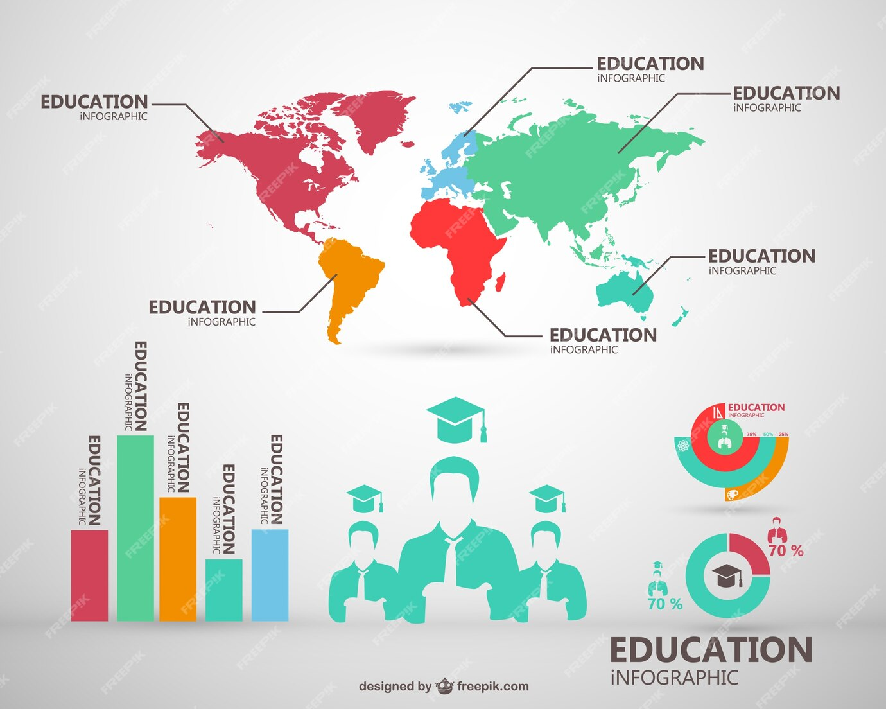

# Educational System Data Analysis 

The company is undertaking an international expansion project. Our mission is to conduct an exploratory data analysis to determine if the World Bank's education data can inform this expansion initiative. The data is provided by the World Bank.​

We aim to explore the following questions:

Which countries have a high potential client base for our services?​
For each of these countries, what will be the evolution of this client potential?​
Google Traduction
In which countries should the company prioritize its operations?​
After assessing and cleaning the data, addressing missing values, and selecting our analysis period, we have identified the relevant indicators for our study.

## Mission 

* Validate the quality of this dataset (does it contain many missing or duplicate data?).​
* Describe the information contained in the dataset (number of columns? number of rows?).​
* Select the information that seems relevant to address the issue (which columns contain information useful to address the company's problem?).​
* Determine the order of magnitude of classical statistical indicators for different geographic areas and countries worldwide (mean/median/* standard deviation by country and by continent or geographic block).
## Data 

The World Bank's data is available at:(https://datacatalog.worldbank.org/dataset/education-statistics)

